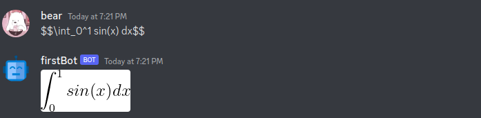

# Functionalities

## Generate random quote (credits to [quotable.io](quotable.io))

Write a message that starts with `$quote please`

| Example |
| --- |
|  |

## Latex

The response in latex is generated by a lazy approach, generating an image using [latex editor](http://www.codecogs.com/latex/eqneditor.php?lang=en-en) by creating an url putting the equation in the url(with some changes), and sending the url, the bot manages to convert the url to photo and send the photo

| Example |
| --- |
|  |

## OPENAI

Ask something to openai and the discord bot will tell you its response, for that  `$openai <whatever>`

> the model im using is `text-davinci-003` and doesn't provide large texts

| Example |
| --- |
|  |